# local-voice

<p align="center">
  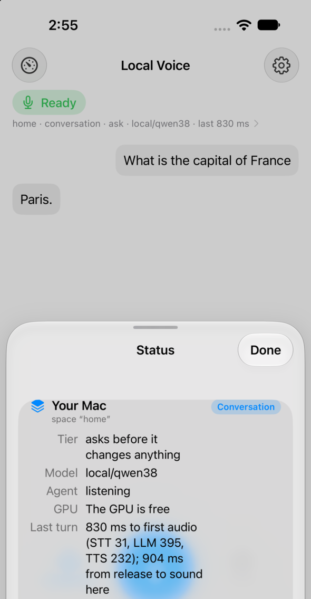
  &nbsp;&nbsp;
  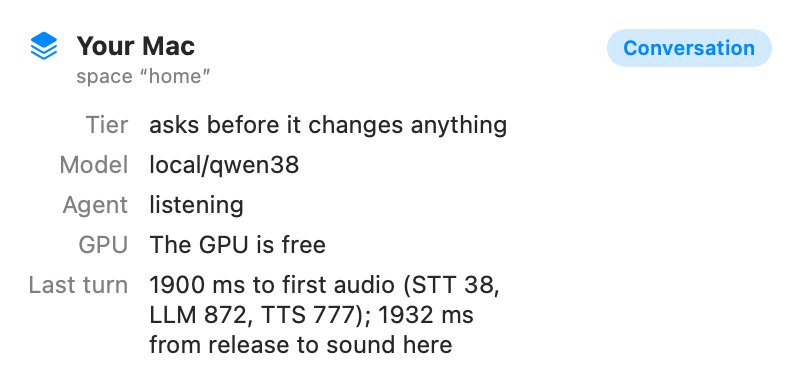
</p>
<p align="center"><sub>The iPhone app (simulator) and the Mac menu-bar app, each after a real spoken turn against the
voice server on the same Mac. The question was synthetic speech from an end-to-end test. Screenshots are from
2026-10-05.</sub></p>

**A fully local voice agent for Apple silicon.** You talk and it talks back, fast enough to feel like a conversation.
It can also act on your Mac through a coding agent ([Pi](https://github.com/badlogic/pi-mono)), scoped to "spaces" such
as your home folder, a journal or a knowledge base. Everything runs on the Mac. A [Pipecat](https://github.com/pipecat-ai/pipecat)
pipeline does the speech work: Silero VAD and Smart Turn v3 decide when you have finished, NVIDIA's streaming Nemotron
ASR (or Parakeet) transcribes you, and Qwen3-TTS (or Kokoro) speaks the reply, all through
[mlx-audio](https://github.com/Blaizzy/mlx-audio). A local LLM behind Pi writes the answer. In a measured test run, the
first audio came **a median 874 ms after the end of speech**. Talking over the agent stops its audio within about a
quarter of a second, and it asks aloud ("Shall I?") before it changes anything. A SwiftUI iPhone app and a Mac
menu-bar app connect to the server over a small WebSocket protocol (on the Mac directly, from the iPhone over
Tailscale). An optional background "brain" reflects on the day's conversations while the Mac is idle.

> Status: a working prototype built in about two days (2026-10-04/05), much of it by coding agents working in parallel
> from a written spec. Milestones M1 (talk from the browser), M2 (the iPhone and Mac apps) and M3 (spaces and spoken
> approvals) pass against real models. Some problems are still open; see [Status and limitations](#status-and-limitations).

## Contents

- [What it does](#what-it-does) · [Screenshots](#screenshots) · [Architecture](#architecture) · [Measurements](#measurements)
- [Requirements](#requirements) · [Setup and usage](#setup-and-usage) · [Repository layout](#repository-layout)
- [Status and limitations](#status-and-limitations) · [Credits and licences](#credits-and-licences)

## What it does

- **Fast turns.** Speech streams in as 16 kHz PCM. A streaming ASR session emits partial transcripts, and its final
  transcript arrives tens of milliseconds after you stop. Smart Turn judges whether you are done. The reply streams
  sentence by sentence into TTS, and the first sentence's leading silence is trimmed.
- **Barge-in.** The reply's audio pauses on the first speech frame, about 70 ms after you start talking. The
  interruption is confirmed when Silero agrees. A cough pauses the reply for a moment and then it carries on. The next
  prompt tells the model how much of its last reply you actually heard (from the client's `played_ms`).
- **Spaces.** "Go to my journal", "the knowledge base", "back home": a router hears switches in natural phrasing. Each
  space has its own Pi child with its own working directory, skills, tool allowlist and risk tier (`readonly`, `ask`,
  `trusted`). See [`docs/SPACES.md`](docs/SPACES.md).
- **Spoken approvals.** In act mode, a Pi extension (`voice_gate.ts`) checks every write, edit or shell call. The agent
  says "I'd like to create a file named notes dot T X T in … Shall I?". The phone, Mac or browser shows a card with the
  exact command, path and preview or diff, and the choices *Do it*, *Allow for this session* and *Don't*. Silence
  means no.
- **A journal space** (optional) built on an Atlas-style markdown journal repo with an `atlas.py` CLI. "Note this: …"
  saves your exact words through the journal's own capture command before the agent replies. **A knowledge-base space**
  (optional) is read-only and searches a markdown wiki through a `kb` CLI.
- **The GPU is shared politely.** If the Mac's GPU lock (the hold gate from the companion repo `local-rig`) is held for
  a render, the server loads nothing, plays a short "busy" notice, keeps your words, and answers when the lock opens.
- **Background brain** (`brain/`, optional, a launchd job). On an idle Mac it reads a finished day's turn log and
  writes technical facts as notes, a reflection draft into the journal's `inbox/`, and a one-line spoken digest for the
  next conversation.
- **Tone hints** (`tone/`, off by default). A CPU library compares pace, pitch, pauses and fillers with your own
  recent usual and gives the model an explicitly uncertain hint. It never names an emotion.

## Screenshots

A recorded demo of a live conversation, with sound, barge-in and a spoken approval, is planned; until then these
are stills. All UI text below is either mock-server output or a synthetic end-to-end test. None of it comes from a real
conversation.

| iPhone app, mock server | Status sheet (journal space, act mode) | Mac panel after a real-server turn |
|---|---|---|
| 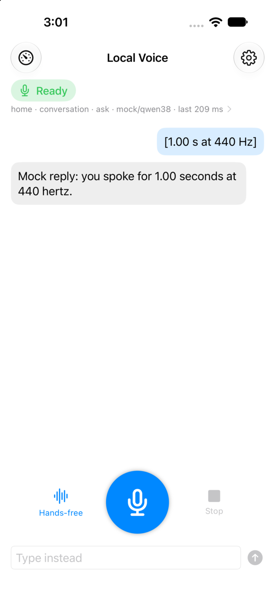 | 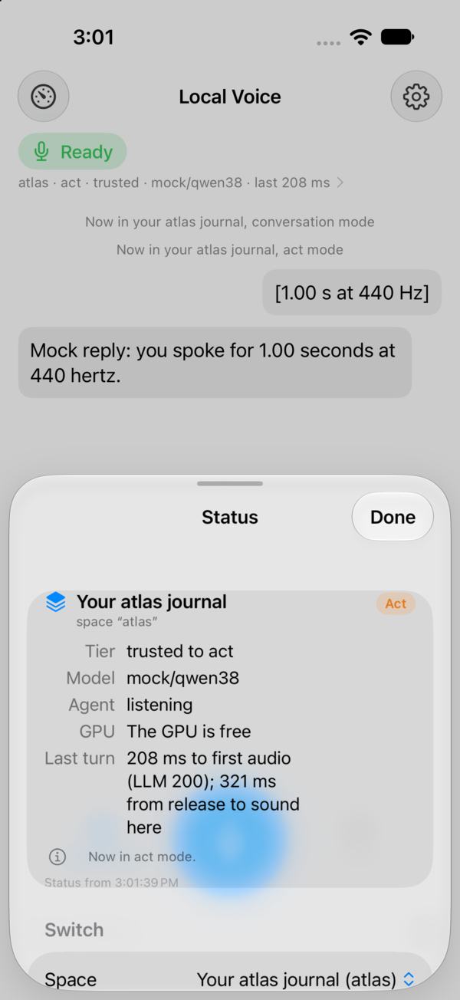 | <br>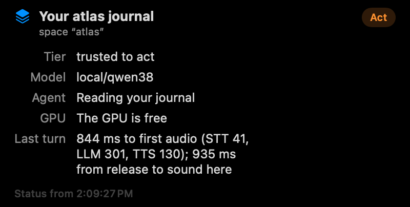<br>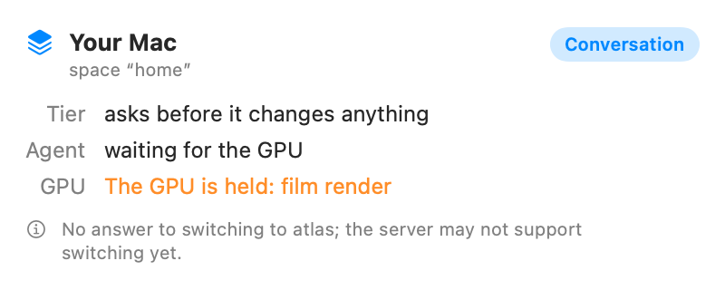 |

**Approval cards.** These are the cards the phone and Mac show while the agent asks aloud "Shall I?". The client
answers with a button, or the person answers by voice. The three below are rendered by the Swift package's snapshot
tests from the mock server's approval scenarios:

| An edit, with its diff | A shell command (another question queued) | A knowledge-base write, session scope offered |
|---|---|---|
| 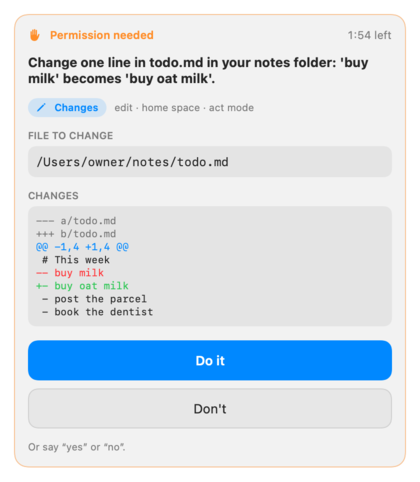 | 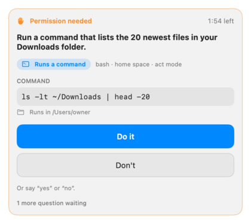 | 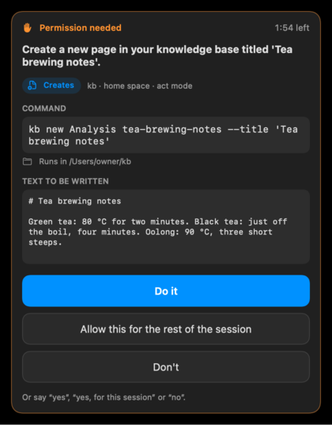 |

The iPhone app supports hands-free and push-to-talk modes, a Live Activity, an Action-button intent and a CallKit
"call mode" (Apple's Push to Talk framework is behind a build flag). The Mac app has a hold-to-talk hotkey (⌥Space by
default) and a floating panel. The dashboards are from the apps' unattended test runs against the mock server
(`clients/apple/MockServer`).

## Architecture

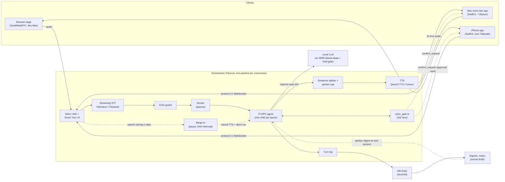

Every model sits behind an adapter that `orchestrator/config.yaml` names (`impl: module:Class`), so swapping a model is
a config change. All MLX work runs on one thread, which refuses to start inference while the GPU lock is held. The
wire protocol (hello, PCM frames, `transcript`, `reply_text`, `audio_start/end`, `interrupt`, `played_ms`, `mode`,
`space`, `confirm_request`/`confirm_response`, close codes, a `/v1/status` endpoint) is specified in
[`docs/PROTOCOL.md`](docs/PROTOCOL.md).

One warm turn, with the latency budget measured in the M1 run (server-side timestamps, 5 warm turns; the details are
under [Measurements](#measurements)):

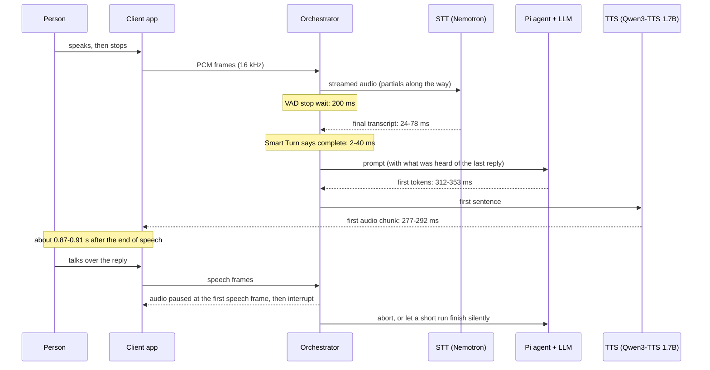

## Measurements

All numbers below were measured on one Mac: Apple M5 Max, 128 GB, macOS 27. The end-to-end tests used macOS `say`
voices streamed at real-time pace by a protocol v1 test client; no human recordings were used. The charts are drawn
from files in this repo by [`docs/make_charts.py`](docs/make_charts.py).

### End of speech to first audio

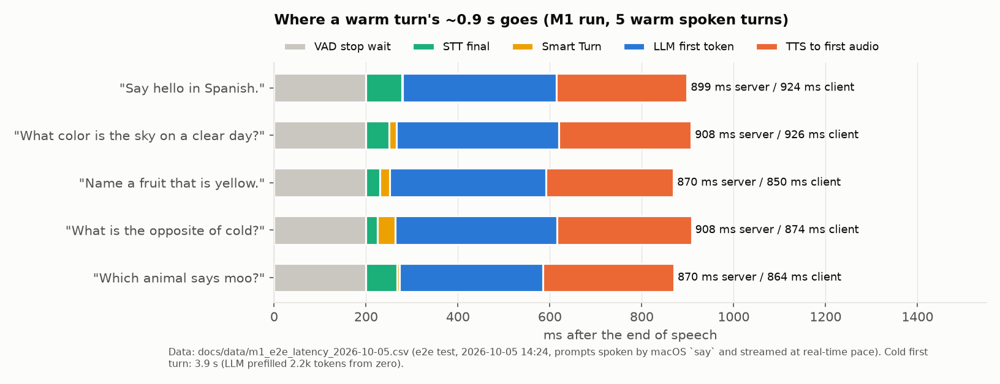

The M1 run (2026-10-05, 14:24) used 6 spoken questions. Transcripts were 6 of 6 correct, apart from "moo" heard as
"Mu" (WER 0.25). At the client, the 5 warm turns took 924, 926, 850, 874 and 864 ms, a **median of 874 ms**, against a
1.5 s target and a 0.9 s goal. The **cold first turn took 3.9 s**, because the LLM server had evicted its prompt cache
and prefilled 2.2k tokens from zero. In the tool turn, "Let me look that up." played at 1.26 s, and the answer
followed after two tool calls (42 s in all, 38 s of it speech). Source:
[`docs/data/m1_e2e_latency_2026-10-05.csv`](docs/data/m1_e2e_latency_2026-10-05.csv).

**What moved the number.** The same pipeline measured 2.4-4.8 s earlier that day. Every millisecond of the difference
was the LLM's first token after a few seconds of idle (2.7-6.8 s). The cause was the LLM server's process scheduling,
not the prompt. llama-swap's launchd job ran it at `ProcessType Background`, which stretched the server's 1-second
GPU-queue keepalive to 4-7 s. On this macOS, the GPU mappings are rebuilt after about 1 s of queue idle. Switching to
`Interactive` with a 250 ms keepalive cut the first token to 0.31-0.40 s:

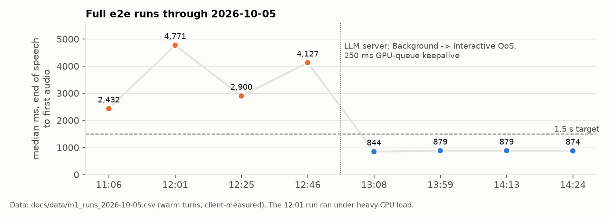

### Text-to-speech engines

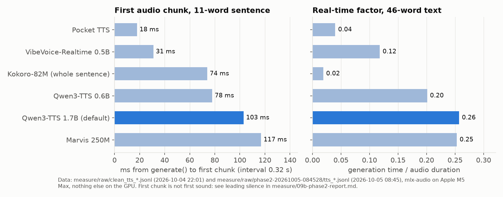

Each figure is the median of 3 runs, through mlx-audio, with nothing else on the GPU. The first chunk does not mean
first sound. Several engines generate leading silence: from 0.42 s for Qwen3-TTS 0.6B up to 0.86 s in the worst
VibeVoice run. Qwen3-TTS 1.7B, the default voice, had 0.08 s of leading silence. Marvis had none. The project uses
Qwen3-TTS 1.7B CustomVoice for voice quality, and every engine here is an adapter away. The full tables, including
non-streaming and long-text runs, are in [`measure/09b-phase2-report.md`](measure/09b-phase2-report.md) and
[`measure/09-phase1-report.md`](measure/09-phase1-report.md). The raw data is in `measure/raw/`.

### Speech models next to the LLM

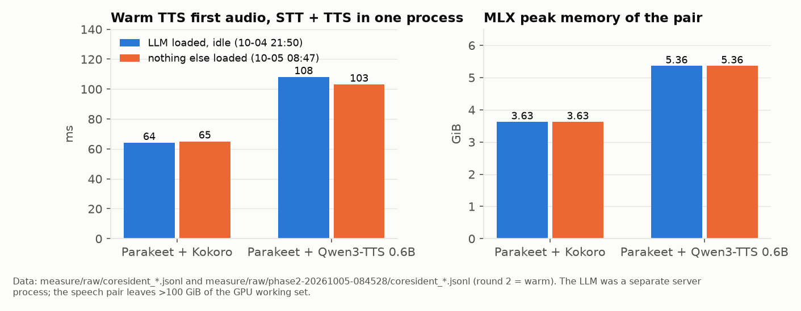

STT and TTS ran in one process, once beside a resident but idle LLM (2026-10-04) and once with nothing else loaded
(2026-10-05). Warm latency and memory were the same within noise. The speech stack's peak is 3.6-5.4 GiB, which
leaves more than 100 GiB of the Metal working set for the LLM. One honest caveat: during the 10-04 run, Qwen3-TTS 0.6B
over-generated a 10-word reply into 29 chunks (about 14 s of audio).

### Turn-taking and barge-in trade-offs

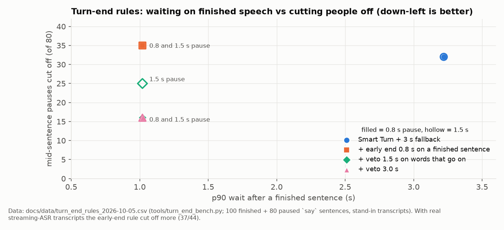

The turn-end bench (`orchestrator/tools/turn_end_bench.py`, CPU only) spliced 0.8 s or 1.5 s pauses into the middle
of sentences to see which rules cut people off. Smart Turn alone cut off 32 of 80 mid-sentence pauses. That is a
bigger problem than its slow "incomplete" calls. With the real streaming ASR's transcripts, which punctuate fragments
as sentences, the early-end rule did worse (37/44 cut off), so it ships off. The shipped setting is Smart Turn with a
2.0 s silence fallback.

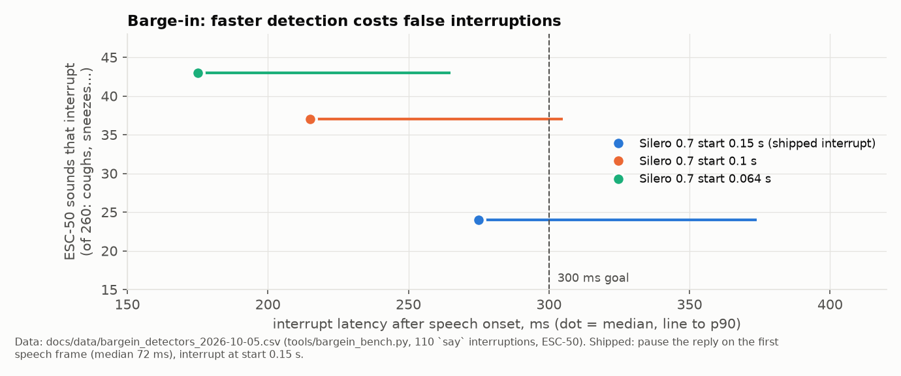

The barge-in bench used 110 synthetic interruptions and 260 ESC-50 sounds scaled to speech level. A faster Silero
setting interrupts sooner but also on more coughs and sneezes. So the shipped design pauses the reply's audio on a
single speech frame (median 72 ms) and interrupts only when Silero confirms. With real models, the audio stopped
238-267 ms after speech start. The `interrupt` message came at 325-346 ms, which misses the 300 ms target by 25-46 ms.

## Requirements

- **Hardware**: an Apple silicon Mac. Everything was built and measured on an M5 Max with 128 GB. The speech stack
  alone needs about 5 GiB of unified memory. The LLM is the big cost: the default `local/qwen38` is a large MoE model,
  and a smaller model will work with a slower or weaker brain.
- **macOS 27** (the measurement machine), Python 3.12, [`uv`](https://github.com/astral-sh/uv), zsh. The Apple clients
  need Xcode 27 and [XcodeGen](https://github.com/yonaskolb/XcodeGen).
- **[Pi](https://github.com/badlogic/pi-mono)** (the coding agent, driven over its RPC mode; built against Pi 0.99.1)
  with a `local` provider in `~/.pi/agent/models.json`, which the server only reads.
- **An OpenAI-compatible local model server.** The defaults expect llama-swap on `127.0.0.1:8090`, fronted by a GPU
  "hold gate", as set up in the companion repo **`mthomas100/local-rig`**. Without the gate the server treats the GPU as
  free (`absent` counts as open).
- **Models** (downloaded once from Hugging Face; `run.sh` then runs with `HF_HUB_OFFLINE=1`):
  `mlx-community/nemotron-3.5-asr-streaming-0.6b-8bit`, `mlx-community/parakeet-tdt-0.6b-v3`,
  `Qwen/Qwen3-TTS-12Hz-1.7B-CustomVoice`, and optionally `mlx-community/Kokoro-82M-bf16`; Smart Turn v3 and Silero
  come with Pipecat.
- **Optional**: an Atlas-style journal repo (`ATLAS_REPO`, default `~/atlas`) and a `kb` knowledge-base CLI
  (`KB_HOME`, default `~/kb`) for the journal and knowledge-base spaces. Without them, use the `home` space or edit
  `orchestrator/spaces.yaml`. Tailscale is optional, for the iPhone.

This is a personal rig, not a packaged product. Expect to edit `config.yaml` and `spaces.yaml` for your machine.

## Setup and usage

```bash
git clone https://github.com/mthomas100/local-voice && cd local-voice/orchestrator
uv sync --python 3.12 --extra kokoro                     # run.sh does this too on first start
# download the models named in config.yaml once (run.sh runs offline), e.g.
.venv/bin/python -c "from huggingface_hub import snapshot_download as d; d('Qwen/Qwen3-TTS-12Hz-1.7B-CustomVoice')"
./run.sh --check                                         # load, warm, render the busy notice, exit
./run.sh                                                 # serve; Ctrl-C stops and releases everything
```

- **Browser**: open <http://127.0.0.1:7860>, allow the microphone, and talk. Headphones are recommended (see the echo
  limitation below).
- **Terminal**: `.venv/bin/python -m local_voice.client --say "what is the capital of France?"`
- **Mac app**: `cd clients/apple && ./build.sh mac && open build/DerivedData/Build/Products/Debug/LocalVoice.app`, then
  hold ⌥Space and talk.
- **iPhone**: set `LV_MAC_TAILNET_HOST` and `DEVELOPMENT_TEAM` in `clients/apple/project.yml`, run
  `./build.sh generate`, and install from Xcode. See [`clients/apple/README.md`](clients/apple/README.md).
- **By voice**: "go to my journal", "the knowledge base", "back home"; "act mode" lets it change things (each change
  asks first) and "just talk" goes back.

Tests: `orchestrator/.venv/bin/python -m pytest -q` runs the model-free suite: fakes, a stub LLM, a real Pi child and a
test hold gate. `pytest -m e2e tests/e2e` runs the real-model tests. In `clients/apple`, `./build.sh test` runs the
Swift unit tests and `./build.sh e2e` runs the apps against the mock server. `brain/` and `tone/` have their own
model-free suites.

## Repository layout

| Path | What |
|---|---|
| `orchestrator/` | the voice server: Pipecat pipeline, MLX adapters, Pi RPC bridge, barge-in, echo guard, router, approvals, Pi extensions (`pi/`), benches (`tools/`), tests |
| `clients/apple/` | `LocalVoiceKit` Swift package (protocol codec, WebSocket, audio engines, shared UI), the iPhone and Mac apps, a model-free mock server, and end-to-end tests |
| `brain/` | the idle-time reflection job and its launchd template |
| `tone/` | delivery hints from pace, pitch, pauses and fillers (CPU, off by default) |
| `measure/` | the component benchmarks (scripts in `bench/`, raw JSONL in `raw/`, reports) |
| `research-prototypes/` | the due-diligence prototypes: Pi RPC bridge and a local-model voice tool-use test, Pipecat skeletons |
| `docs/` | `PROTOCOL.md` (wire protocol v1), `SPACES.md` (space schema and risk tiers), chart data and media |

## Status and limitations

- **Echo on laptop speakers (open).** In early live use on the browser page with the Mac's own speakers, the agent
  sometimes heard the tail of its own reply, up to a minute later, and answered it. An echo guard now drops words that
  align with the agent's recent speech while it is busy, but it has not yet been checked against real speakers. Use
  headphones, or hold the talk key in the Mac app.
- **Voice quality (open).** In the same sessions, Qwen3-TTS sometimes laughed, swung in pitch or slurred, especially on
  very short sentences. A machine-scored voice-quality bench (`orchestrator/tools/tts_quality_bench.py`: ASR WER,
  pitch range, a laughter detector, UTMOS) has been written but not yet run.
- **Turn-taking.** A long pause mid-sentence can still end your turn early in hands-free mode; holding the talk key
  avoids it.
- **Barge-in costs on the LLM side.** Aborting a long reply mid-generation makes the recurrent LLM server replay the
  conversation from its nearest checkpoint, about 1 s per 1k tokens. Short replies are now allowed to finish silently
  instead.
- **iPhone**: verified in the simulator against the real server. No real-device install yet, and no locked-phone
  conversation yet.
- **The brain and tone hints** were tested against stand-ins and synthetic speech only, not real models or real days.
- **A single-machine project.** Paths, model choices and the GPU lock assume the author's setup. Design notes and the
  research behind the decisions are kept in a private wiki; the reports in `measure/` and the docs here are the public
  part.

## Credits and licences

The code in this repository is MIT-licensed ([`LICENSE`](LICENSE)). No model weights, datasets or third-party code
are included; models are downloaded from their publishers at setup.

| Component | Role | Licence (check the upstream model card or repo) |
|---|---|---|
| [Pipecat](https://github.com/pipecat-ai/pipecat) | real-time voice pipeline, SmallWebRTC transport | BSD-2-Clause |
| [Smart Turn v3](https://github.com/pipecat-ai/smart-turn) | end-of-turn detection | BSD-2-Clause |
| [Silero VAD](https://github.com/snakers4/silero-vad) | voice activity detection | MIT |
| [MLX](https://github.com/ml-explore/mlx), [mlx-audio](https://github.com/Blaizzy/mlx-audio) | on-device inference for STT and TTS | MIT |
| [Qwen3-TTS](https://huggingface.co/Qwen/Qwen3-TTS-12Hz-1.7B-CustomVoice) (Alibaba Qwen) | default voice | Apache-2.0 |
| [Kokoro-82M](https://huggingface.co/hexgrad/Kokoro-82M) | alternative voice | Apache-2.0 |
| [Parakeet TDT 0.6B v3](https://huggingface.co/nvidia/parakeet-tdt-0.6b-v3) (NVIDIA) | batch STT | CC-BY-4.0 |
| [Nemotron streaming ASR](https://huggingface.co/mlx-community/nemotron-3.5-asr-streaming-0.6b-8bit) (NVIDIA; MLX conversion by mlx-community) | live STT (default) | see the model card |
| [VibeVoice-Realtime](https://huggingface.co/microsoft/VibeVoice-Realtime-0.5B) (Microsoft), [Pocket TTS](https://huggingface.co/kyutai) (Kyutai), [Marvis TTS](https://huggingface.co/Marvis-AI) | benchmarked alternatives | see each model card |
| [Pi](https://github.com/badlogic/pi-mono) | the agent harness driven over RPC | see the repo |
| [Parselmouth](https://github.com/YannickJadoul/Parselmouth) (Praat) | pitch tracking in `tone/` (a dependency, installed separately, not vendored; `pyin` is a permissive alternative) | GPL-3.0 |
| [ESC-50](https://github.com/karolpiczak/ESC-50) | environmental sounds for the barge-in bench (fetched by `tools/fetch_esc50.sh`, not included) | CC BY-NC 3.0 |

The synthetic test speech comes from macOS's built-in `say` voices. The screenshots are of this project's own apps,
taken during their automated test runs.
